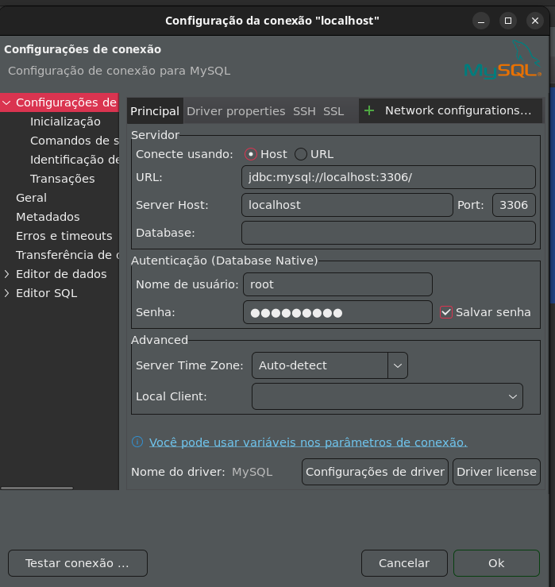

# kafka--estudo-microsoft-cdc-source-connector
Projeto para estudo de aplicação para estudo do uso do design pattern Change Data Capture (CDC) para monitorar alterações em um banco de dados com o Kafka


## Sumário
- [Tecnologias](#tecnologias)
- [Arquitetura de Software para Desenvolvimento](#arquitetura-de-software-para-desenvolvimento)
- [Arquitetura dos componentes](#arquitetura-dos-componentes)
    - [service--userdata](#service--userdata)
    - [userdata](#userdata)
    - [Kafka Source Connector](#kafka-source-connector)
    - [cdc.info-user](#cdcinfouser)
    - [service--push-email](#service--push-email)
- [Referencias](#referencias)


## Tecnologias

- Microsoft SQL Server
- Apache Kafka 3.5
- Kafka Connectors
- Kubernetes
- **(A definir linguagem de programação dos serviços)**


## Arquitetura de Software para Desenvolvimento

Todos os projetos desenvolvidos no estudo irão seguir o design arquitetural da Arquitetura Hexagonal, afim de pratica a separação dos componentes internos e externos da camada de negócio. Os projetos terão a estrutura do desenho a seguir:


Estrutura do projeto:

- **Transport Layer**: Camada para a entrada de dados do projeto, podendo ser um controller REST API, uma FILA SQL, etc.

- **Interactors**: Camada de negócio da aplicação, que representa toda a logica do negócio, como validações, utilizando principalmente a camada de entities como seus objetos.

- **Entities**: Camada de dominio dos objetos, eles representam a camada de dominio e contem os objetos que representam os conceitos principais para o negócio.

- **Repositories**: Camada de acesso a recursos externos da aplicação, nessa camada ainda não é definida a tecnologia dos recursos externos, sendo apenas uma porta de acesso para serviços fora da aplicação.

- **Data Sources**: Camada que representa os recursos externos que são acessiveis pela camada de Repositories da aplicação, podendo ser um banco de dados, um serviço externo que responde por REST API, uma fila, etc.


## Arquitetura dos componentes

A seguir está detalhado os componentes que irão compor o estudo


### service--userdata
Serviço é responsavel por todas as alterações de dados de usuário realizadas no banco de dados. O serviço irá responder via REST API.

### userdata
Banco de dados que terá armazenados os dados do usuário. O banco será configurado para utilizar o Desing Pattern CDC, assim todas as alterações realizadas no banco serão armazenadas em uma tabela SQL separa.

### Kafka Source Connector
Conector Kafka Microsoft SQL Server CDC Source Connector para integrar com o banco de dados, sendo responsavel por produzir as mensagens de atualização de dados cadastrais para um tópico Kafka.

### cdc.info-user
Tópico Kafka responsavel por receber as atualizações de dados cadastrais, essa informação será consumida pelo serviço de push por email. O objetivo do tópico é informar a todas as partes interessadas sobre a atualização de dados cadastrais.


### service--push-email
Serviço responsavel por realizar o envio de notificações para usuários via email. O serviço irá consumir o tópico kafka cdc.inf-user para que seja enviado sobre a atualização de dados cadastrais para o usuário


## Criação banco de dados


### Kubernetes

Para criar o banco de dados, será utilizado o Kubernetes para a infraestrutura do servidor. Para o teste local, está sendo utilizado o [Microk8s](https://microk8s.io/).

 Com o arquivo .kubeconfig configurado no seu computador, para criar o banco de dados no cluster Kubernetes, basta acessar o diretório ```k8s/microsoft-sql-server/``` e executar o comando a seguir:

```sh
kubectl apply -k .

namespace/mssql created
service/mssql created
pod/mssql created
```

para validar a execução do pod do banco de dados, basta listar o pod pelo namespace com o comando a seguir:

```sh
kubectl get pods -n mssql

NAME    READY   STATUS    RESTARTS   AGE
mssql   1/1     Running   0          8m41s
```

#### Acessar o banco de dados

Para acessar o banco de dados, está sendo utilizado o [DBeaver](https://dbeaver.io/). Para conectar com o banco executado localmente no Microk8s, basta acessar com a host `localhost`, porta `31433` (porta exposta pelo service), usuario `sa` e a senha está no artefato kubernetes `pod.yaml`.




## Referencias

- [Hexagonal Architeture by netflixtechblog](https://netflixtechblog.com/ready-for-changes-with-hexagonal-architecture-b315ec967749)
- [C4 Model](https://c4model.com/)


